# ZooKeeper

ZooKeeper is a Java console application that simulates a zoo management system. It allows users to add various animals to the zoo, list all animals, and make them produce sounds.

## Class Structure

The following diagram shows the class structure of the ZooKeeper application:

```mermaid
classDiagram
    Animal <|-- Lion
    Animal <|-- Elephant
    Animal <|-- Penguin
    Animal <|-- Giraffe
    Animal <|-- Monkey
    Animal <|-- Crocodile
    Animal <|-- Kangaroo
    Animal <|-- Camel
    Animal <|-- Owl
    class Animal {
        <<abstract>>
        -String name
        -int age
        -String sound
        +Animal(String name, int age, String sound)
        +abstract void makeSound()
        +String getName()
        +int getAge()
        +String getSound()
    }
    class Lion {
        -boolean isMale
        +Lion(String name, int age, boolean isMale)
        +void makeSound()
        +boolean isMale()
    }
    class Elephant {
        -double trunkLength
        +Elephant(String name, int age, double trunkLength)
        +void makeSound()
        +double getTrunkLength()
    }
    class Penguin {
        -String species
        +Penguin(String name, int age, String species)
        +void makeSound()
        +String getSpecies()
    }
    class Giraffe {
        -double neckLength
        +Giraffe(String name, int age, double neckLength)
        +void makeSound()
        +double getNeckLength()
    }
    class Monkey {
        -String species
        +Monkey(String name, int age, String species)
        +void makeSound()
        +String getSpecies()
    }
    class Crocodile {
        -double length
        +Crocodile(String name, int age, double length)
        +void makeSound()
        +double getLength()
    }
    class Kangaroo {
        -double jumpHeight
        +Kangaroo(String name, int age, double jumpHeight)
        +void makeSound()
        +double getJumpHeight()
    }
    class Camel {
        -int numHumps
        +Camel(String name, int age, int numHumps)
        +void makeSound()
        +int getNumHumps()
    }
    class Owl {
        -String species
        +Owl(String name, int age, String species)
        +void makeSound()
        +String getSpecies()
    }
    class ZooKeeper {
        -List<Animal> animals
        -Scanner scanner
        +main(String[] args)
        -addAnimal()
        -listAnimals()
        -makeAllAnimalsSounds()
        -getStringInput(String prompt)
        -getIntInput(String prompt)
        -getDoubleInput(String prompt)
        -getBooleanInput(String prompt)
    }
```

## Features

1. Add animals to the zoo
2. List all animals in the zoo
3. Make all animals produce their sounds
4. Interactive console interface

## How to Run

1. Compile all Java files
2. Run the ZooKeeper class
3. Follow the on-screen prompts to interact with the zoo management system

Enjoy managing your virtual zoo!